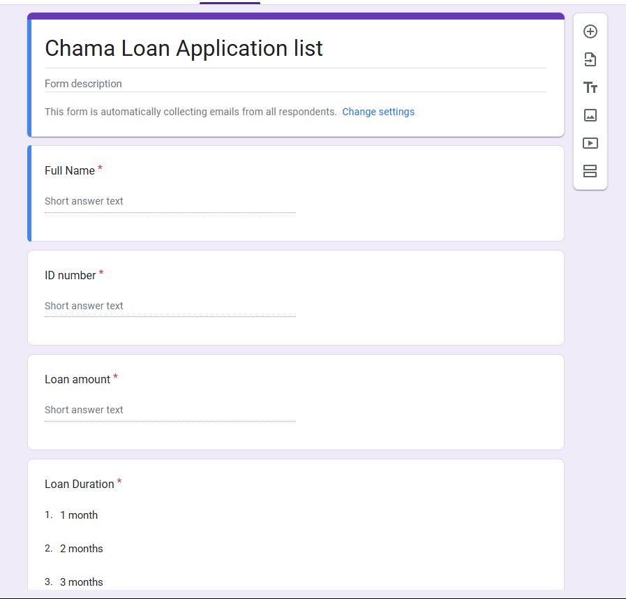
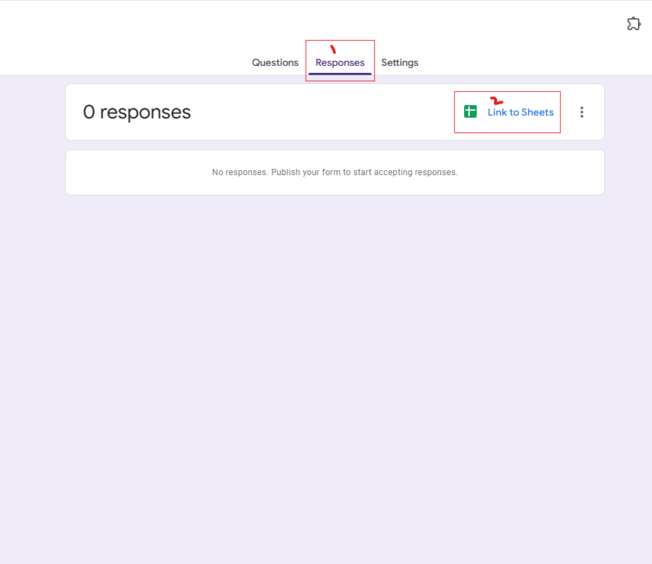
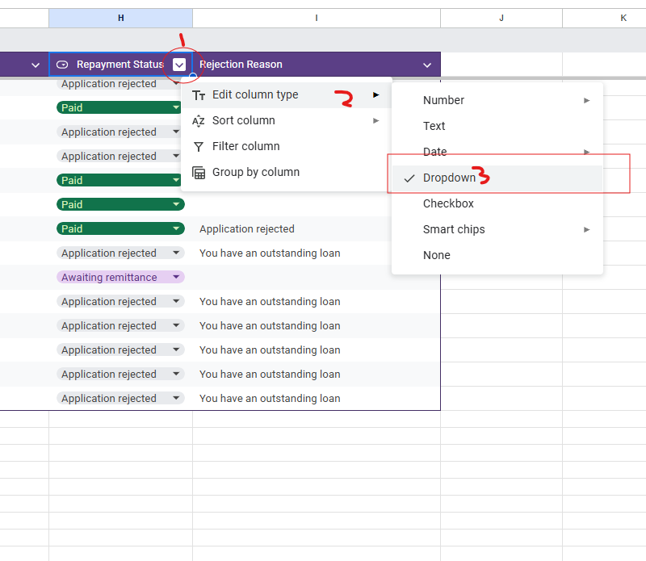
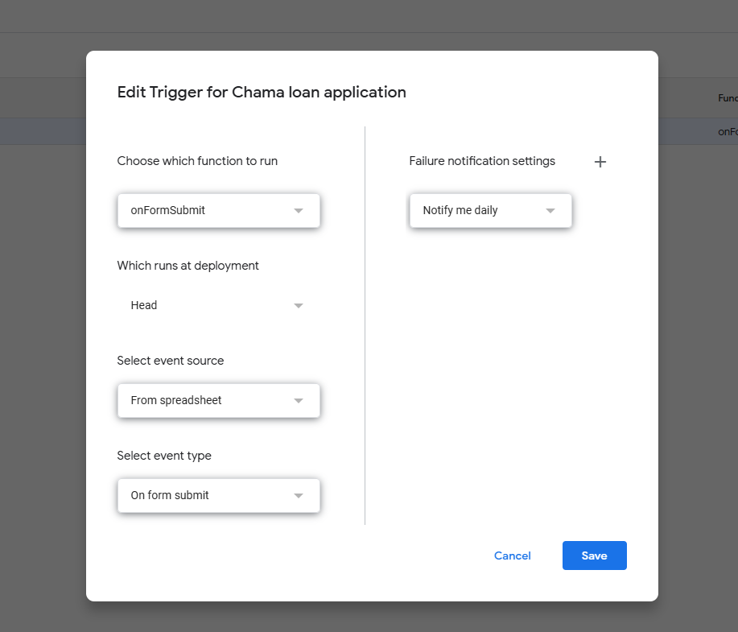
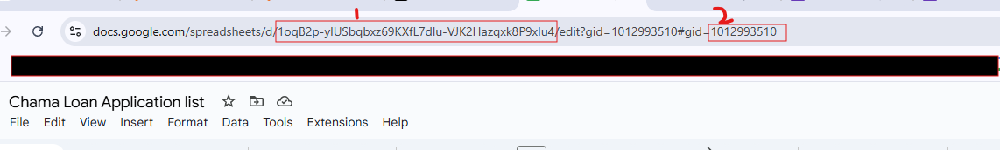

# Capital-Club-Google-Form
This is a repo containing capital club google form for a loan application

## Setup
 ### 1. Create a Google Form
- Go to your google account and create a new form.

 - Add the following fields to your google form.

    1. Full Name (short answer, required)
    2. ID number (short answer, required)
    3. Loan Amount (short answer, required)
    4. Loan Duration (Dropdown, required) (In months,  limit it to 6 months for now)

- You should have a form that looks like this:

### 2. Add Sheets
- Once you add all the field, go to the Responses and link to sheets

- Open the sheet and add the following extra fields to the sheet:
    1. Email Address
    2. Loan Status.  
    Make this column a dropdown and add the following dropdown fields 
        - In progress
        - Paid
        - Application rejected
        - Awaiting remittance
        - Defaulted
        
    3. Repayment status
    4. Rejection Reason

- Add a new sheet called Members list and add The following columns in the following order:
    1. Full Name
    2. Email Address
    3. ID
    4. Loan Limit
  
- Add all the chama members with their respective details

### 3. Add Apps Script

- Click on `Extensions`, then click on `Apps Script` to start adding the code.  
Add the following files to the Apps Script and add the content from the respective files in this repository
    1. onFormSubmit.gs
    2. sendEmail.gs
    3. getSheetById.gs
    4. acceptedEmail.html
    5. rejectedEmail.html
    6. treasurerEmail.html

- Once you are done adding the files and the content, go to `Triggers` and add a new trigger as shown in the image below
  

  This adds a trigger that runs the `onFormSubmit` function once the form is submitted.

### 4. Add Script properties
- Open `Project Settings`
- Add the following Script Properties
  1. `TREASURER_EMAIL`
  2. `FORM_SHEET_GID`
  3. `FORM_SHEET_ID`
  4. `MEMBER_SHEET_NAME`

- To get the `FORM_SHEET_ID` and `FORM_SHEET_GID` they are **1** and **2** respectively in the image below. 

  This is the *url of the **form response sheet***
